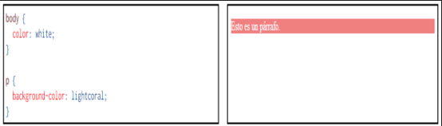

# Ejercicio 1 - Responder

## 1. ¿Qué es CSS y para qué se usa?
CSS proviene de las siglas de Cascading Style Sheets, que en español se traduce "Hoja de Estilos en cascada", y es un mecanismo simple que describe cómo se va a mostrar un documento en la pantalla, o cómo se va a imprimir, o incluso cómo va a ser pronunciada la información presente en ese documento a través de un dispositivo de lectura. Esta forma de descripción de estilos ofrece a los desarrolladores el control total sobre el estilo y formato de los documentos. 

En otras palabras gracias a CSS podemos especificar estilos como el tamaño, fuentes, color, espaciado entre textos y recuadros así como el lugar donde disponer texto e imágenes en la página.

## 2. CSS utiliza reglas para las declaraciones de estilo,¿cómo funcionan?
CSS funciona a base de reglas, es decir, declaraciones sobre el estilo de uno o más elementos. Las hojas de estilo están compuestas por una o más de esas reglas aplicadas a un documento HTML o XML. La regla tiene dos partes: un selector y la declaración. A su vez la declaración está compuesta por una propiedad y el valor que
se le asigne. 

El selector funciona como enlace entre el documento y el estilo, especificando los elementos que se van a ver afectados por esa declaración. La declaración es la parte de la regla que establece cuál será el efecto.

## 3. ¿Cuáles son las tres formas de dar estilo a un documento?
Las tres formas más conocidas de dar estilo a un documento son las siguientes:
 - Utilizando una hoja de estilo externa que estará vinculada a un documento a través del elemento `<link>`, el cual debe ir situado en la sección `<head>`. 
 - Utilizando el elemento `<sytle>`, en el interior del documento al que se le quiere dar estilo, y que generalmente se situaría en la selcción `<head>`. De esta forma los estilos serán reconocidos antes de que la página se cargue por completo. 
 - Utilizando estilos directamente sobre aquellos elementos que lo permiten a través del atributo `<sytle>` dentro de `<body>`. Pero este tipo de estilo pierde las ventajas que ofrecen las hojas de estilo al mezclarse el centenido con la presentación. 

## 4. ¿Cuáles son los distintos tipos de selectores más utilizados? Ejemplifique cada uno.
Los selectores se utilizan para seleccionar los elementos HTML que queremos diseñar, existen distintos tipos como: 

- **Selector de elementos**
Seleccione elementos HTML en función del nombre del elemento 
`h2{color:gray};`

- **Agrupación de selectores**
Supongamos que queremos que distintos elementos tengan el mismo estilo, por ejemplo: 

`h2{color:gray};`

`p{color:gray};`

Y con agrupación de selectores, de manera mas sensilla podriamos poner: 

`h2, p{color:gray};`

- **Selector universal**
El selector universal `(*)` selecciona todos los elementos del HTML, por ejemplo: 
`*{margin:0;`
`}`
actúa como un *comodín* que coincide con cualquier elemento. 

- **Selector de clase**
Es la forma más común de aplicar estilos, para que los selectores de clase funcionen y asociar los estilos de esa clase a algún elemento, simplemente debemos agregar el atributo `class` a ese elemento:

`
 Estamos aprendiendo CSS 
`

Ahora, agregamos los estilos de la clase

`.nombreClase{`
                `color:pink`
                `font-size:20px`
            `}`

En HTML es posible agregar más de una clase a un elemento. 

`
 Texto 
`

`<h2 class=nombreClase> Texto </h2>`
 
`.nombreClase{ color:pink;`

`fontsize:20px;}`

`h2.nombreClase {font-weight:bold;}`

- **Selector ID**
De cierta forma el selector ID es similar al selector de clase, excepto por que al selector de ID lo precede un hash, y que el id puede utilizarse en un único elmento del HTML.

`
 Texto 
`

`#cosito{`

`background:yellow;`

`}`

## 5. ¿ Qué es una pseudo-clase? ¿Cuáles son las más utilizadas aplicadas a vínculos?

Palabra clave que se añade a los selectores y que especifica un estado especial del elemento seleccionado, todas las pseudo-clases son una palabra precedida por dos puntos (:), por ejemplo podemos encontrar: 
- :empty

Con esta pseudo-clase podemos seleccionar cualquier elemento que no tenga hijos de ningún tipo, incluyendo textos o espacios en blanco. 

- :first-child

Se usa para seleccionar elementos que son los primeros hijos de otros elementos. 

- :first-of-type

Representa el primer elemento de su tipo entre un grupo de elementos hermanos. 

- :nth-child

Coincide con un elemento en función de su posición entre un grupo de hermanos. 

Los más utilizados aplicadas a vínculos son: 
- :link

Se refiere a un enlace y apunta a un link quue no ha sido visitado. 

- :visited

Se refiere a un enlace que ya ha sido visitado. 

## 6. ¿ Qué es la herencia?

Principio que permite que las propiedades de estilo aplicadas a un elemento se transmitan a sus elementos secundarios (hijos) dentro de la jerarquía del documento HTML. Esto significa que si aplicas un estilo a un elemento principal, ese estilo se aplicará automáticamente a todos sus descendientes, a menos que se anule explícitamente.

La herencia en CSS funciona para muchas propiedades, como color de texto, tamaño de fuente, tipo de fuente y otras propiedades relacionadas con la tipografía. Sin embargo, no todas las propiedades se heredan; algunas propiedades, como el margen o el padding, no se heredan y deben aplicarse a cada elemento de forma individual.

Para indicar explícitamente que un elemento no debe heredar una propiedad, se utiliza la propiedad inherit.

## 7. ¿ En qué consiste el proceso denominado cascada?

El formato final en cualquier elemento depende de la combinacón de todas las propiedades que afectan al elemento. La denominación de hojas de estilo em cascada hace referencia precisamente a este hecho. 

Por ejemplo, una de las reglas es que a un elemento le afectan todas las propiedades de los elementos en los que está incluido, como muestra el siguiente ejemplo, en el que el color de texto del párrafo `
` viene determinado por la propiedad establecida para el elemento `<body>`:

