# Ejercitacion 3
### En cada caso, explicar las diferencias entre los segmentos de código y sus visualizaciones:

## Inciso a
```html
1. <a href="http://www.google.com.ar">Click aquí para ir a Google</a>
2. <a href="http://www.google.com.ar" target="_blank">Click aquí para ir a Google</a>
3. <a href="http://www.google.com.ar" type="text/html" hreflang="es" charset="utf-8" rel="help">
4. <a href="#">Click aquí para ir a Google</a>
5. <a href="#arriba">Click aquí para volver arriba</a>
   <a name="arriba" id="arriba"></a>
```


La diferencia entre el punto 1 y el punto 2 radica en el lugar donde se abre el enlace al que se hace referencia en el atributo `href`. En la línea 1 está programado para que se abra en la misma ventana, mientras que en el punto 2, al tener el atributo `target="_blank"`, indica que se abrirá en una nueva ventana.

El punto 3 también es un enlace a Google, pero incluye mucha más información. Esto se debe a que los atributos `type="text/html"` indican que se trata de un documento en HTML, `hreflang="es"` señala que el idioma es español, `charset="utf-8"` especifica la codificación de caracteres y `rel="help"` indica que este enlace es de tipo ayuda o proporciona información. Sin embargo, parece estar incompleto debido a la falta de texto donde se muestre el enlace, así como la ausencia del cierre de la etiqueta `</a>`.

En el punto 4, encontramos una etiqueta que permite regresar a una parte de la misma página. No obstante, en este caso no está completa. Por otro lado, en el punto 5 sí encontramos una etiqueta que nos permite desplazarnos dentro de la misma página. En este caso, nos envía a la otra etiqueta con el nombre `"arriba"`.


## Inciso b
```html
1. <p><a href="http://www.google.com.ar">Click aquí</a></p>
2. <p><a href="http://www.google.com.ar"></a> Click aquí</p>
3. <p><a href="http://www.google.com.ar">Click aquí</a></p>
4. 
<p>
    <a href="http://www.google.com.ar"></a> 
    <a href="http://www.google.com.ar">Click aquí</a>
</p>
```
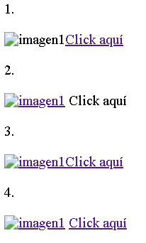

En este caso, al igual que en el inciso anterior, nos encontramos con enlaces que nos dirigen a Google. Sin embargo, al utilizar la etiqueta `<p>`, indicamos que todo lo que esté entre estas etiquetas estará en el mismo párrafo. Las diferencias entre los puntos de este inciso se encuentran específicamente en el lugar donde debemos hacer clic para ser redirigidos al enlace correspondiente.

En el punto 1, encontramos una imagen y, por separado, el enlace acompañado del texto `Click aquí`. Por otro lado, en el punto 2, es la imagen misma en la que debemos hacer clic para que nos redireccione. Además, hay un texto que dice `Click aquí`, pero sin ninguna funcionalidad asociada. En el punto 3, en cambio, podemos hacer clic tanto en la imagen como en el texto, ambos nos enviarán a Google. Por último, en el punto 4, observamos el mismo comportamiento que en el punto 3. Sin embargo, en este caso, los enlaces están separados. Esto nos permite configurar el clic en la imagen para que nos lleve a un enlace y el clic en el texto para que nos dirija a otro enlace.


## Inciso c
1. 
```html
<ul> 
<li>xxx</li>
<li>yyy</li>
<li>zzz</li>
</ul>
```
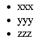 <br>
2. 
```html
<ol>
<li>xxx</li>
<li>yyy</li>
<li>zzz</li>
</ol>
```
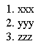 <br>
3.
```html
<ol>
<li>xxx</li>
</ol>
<ol>
<li value="2">yyy</li>
</ol>
<ol>
<li
value="3">zzz</li>
</ol>
```
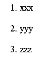 <br>
4.
```html
<blockquote>
<p>1. xxx<br />
2. yyy<br />
3. zzz</p>
</blockquote>
```
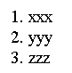

En este inciso, tratamos con listas. En el primer caso, nos encontramos con una lista sin enumerar, mientras que en los casos restantes todas son enumeradas. Sin embargo, existen diferencias notables entre ellas.

En el punto 2, observamos una única lista con elementos enumerados automáticamente. Por otro lado, en el punto 3, se crea una nueva lista por cada elemento, y cada uno de estos elementos se enumera con un número específico. Por último, en el punto 4, encontramos una situación bastante diferente. Estos elementos están contenidos dentro de etiquetas `<blockquote>`, las cuales se utilizan para referenciar citas, como por ejemplo, de un libro. Esto podría estar representando una lista ordenada de citas de libros u otras referencias.


## Inciso d
1.
```html
<table border="1" width="300">
<tr>
<th>Columna 1</th>
<th>Columna 2</th>
</tr>
<tr>
<td>Celda 1</td>
<td>Celda 2</td>
</tr>
<tr>
<td>Celda 3</td>
<td>Celda 4</td>
</tr>
</table>
```
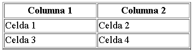

2.
```html
<table border="1" width="300">
<tr>
<td><div align="center"><strong>Colum
na1</strong></div></td>
<td><div align="center"><strong>Columna 
2</strong></div></td>
</tr>
<tr>
<td>Celda 1</td>
<td>Celda 2</td>
</tr>
<tr>
<td>Celda 3</td>
<td>Celda 4</td>
</tr>
</table>
```
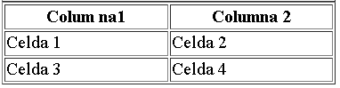

En este inciso, tratamos el tema de las tablas. A simple vista, las tablas parecen ser bastante similares, siendo la principal diferencia los encabezados de la tabla.

En la parte 1 del código, los encabezados están contenidos dentro de etiquetas `<th>`, indicando su naturaleza de encabezados. Por otro lado, en la parte 2, se ha destacado el encabezado aplicando un atributo `align="center"` para centrarlo dentro de la celda, además de utilizar la etiqueta `<strong>` para dar énfasis al texto y mostrarlo en negrita. Sin embargo, es importante notar que este enfoque ha sido implementado dentro de etiquetas `<td>`. Esto significa que, sin estos atributos adicionales, visualmente la celda sería igual a las que se encuentran debajo.

## Inciso e
1.
```html
<table width="200">
<caption>
    Título
</caption>
<tr>
<td bgcolor="#dddddd">&nbsp;</td>
<td bgcolor="#dddddd">&nbsp;</td>
<td bgcolor="#dddddd">&nbsp;</td>
</tr>
<tr>
<td bgcolor="#dddddd">&nbsp;</td>
<td bgcolor="#dddddd">
&nbsp;</td>
<td bgcolor="#dddddd">&nbsp;</td>
</tr> 
</table>
```
 <br>
2.
```html
<table width="200">
<tr>
<td colspan="3"><div align="center">Título</div></td>
</tr>
<tr>
<td bgcolor="#dddddd">&nbsp;</td>
<td bgcolor="#dddddd">&nbsp;</td>
<td bgcolor="#dddddd">&nbsp;</td>
</tr>
<tr>
<td bgcolor="#dddddd">&nbsp;</td>
<td bgcolor="#dddddd">&nbsp;</td>
<td bgcolor="#dddddd">&nbsp;</td>
</tr>
</table>
```


En este caso, presentamos dos tablas en ambos puntos. A simple vista, el contenido de las celdas en ambas tablas es idéntico, con celdas coloreadas de manera similar. La distinción clave entre estas dos radica en sus encabezados.

En la tabla 1, el encabezado se ha incorporado mediante la etiqueta `<caption>`, la cual se emplea precisamente para añadir un título o una descripción a una tabla HTML. Por otro lado, en el punto 2, el encabezado ha sido implementado como una celda convencional, que además se ha centrado dentro de la celda utilizando el atributo `colspan="3"`. Este atributo indica que esa celda abarcará un total de 3 columnas, lo que da la apariencia de una estructura de encabezado.


## Inciso f
1.
```html
<table width="200">
<tr>
<td colspan="3"><div align="center">Título</div></td>
</tr>
<tr>
<td rowspan="2" bgcolor="#dddddd">&nbsp;</td>
<td bgcolor="#dddddd">&nbsp;</td>
<td bgcolor="#dddddd">&nbsp;</td>
</tr>
<tr>
<td bgcolor="#dddddd">&nbsp;</td>
<td bgcolor="#dddddd">&nbsp;</td>
</tr>
</table>
```
 <br>
2.
```html
<table width="200">
<tr>
<td colspan="3"><div align="center">Título</div></td>
</tr>
<tr>
<td colspan="2"
bgcolor="#dddddd">&nbsp;</td>
<td bgcolor="#dddddd">&nbsp;</td>
</tr>
<tr>
<td bgcolor="#dddddd">&nbsp;</td>
<td bgcolor="#dddddd">&nbsp;</td>
<td bgcolor="#dddddd">&nbsp;</td>
</tr>
</table>
```
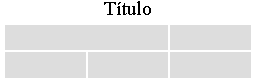

En este caso, nos encontramos nuevamente con dos tablas que son bastante similares entre sí. La distinción principal radica en el uso de los atributos `<colspan="2">` y `rowspan="2"`.

En el punto 1, se ha utilizado la etiqueta `rowspan` para que una celda ocupe 2 columnas en esta tabla. En otras palabras, esta etiqueta permite que una celda se extienda a lo ancho por 2 columnas consecutivas. Por el contrario, en el punto 2, se ha empleado el atributo `colspan` para que una celda abarque 2 filas en esta tabla. En resumen, este atributo hace que una celda se expanda verticalmente ocupando 2 filas consecutivas. 

## Inciso g
1.
```html
<table width="200" border="1">
<tr>
<td colspan="3"><div
align="center">Título</div></td>
</tr>
<tr>
<td colspan="2"rowspan="2">&nbsp;</td>
<td>&nbsp;</td>
</tr>
<tr>
<td width="50%">&nbsp;</td>
</tr>
</table>
```
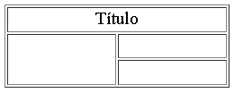 <br>
2.
```html
<table width="200" border="1" cellpadding="0" cellspacing="0">
<tr>
<td colspan="2"><div 
align="center">Título</div></td>
</tr>
<tr>
<td rowspan="2">&nbsp;</td>
<td>&nbsp;</td>
</tr>
<tr>
<td width="50%">&nbsp;</td>
</tr>
</table>
```
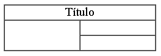

En este inciso, nuevamente encontramos dos tablas muy similares entre sí, cuya distinción principal reside en los bordes de las mismas. En ambos códigos, se ha empleado el atributo `border="1"`, no obstante, las diferencias se encuentran en los atributos `cellpadding="0"` y `cellspacing="0"`.

En la parte 1, se utiliza el atributo `border="1"` para definir un borde alrededor de la tabla. En la parte 2, este atributo también se mantiene, pero se añaden especificaciones adicionales en cuanto a las distancias dentro de la tabla. El atributo `cellpadding` establece el espacio entre el contenido y el borde de una celda, mientras que el atributo `cellspacing` indica el espacio entre las propias celdas.

En resumen, la principal diferencia entre ambas partes radica en la manera en que se manejan las distancias y los espacios dentro de las tablas, a través de los atributos `cellpadding` y `cellspacing`.


## Inciso h
1.
```html
<form id="form1" name="form1" action="procesar.php" method="post" target="_blank">
<fieldset>
<legend>LOGIN</legend>
Usuario: <input type="text" id="usu1" name="usu1" value="xxx" /><br />
Clave: <input type="password" id="clave1" name="clave1" value="xxx" />
</fieldset>
<input type="submit" id="boton1" name="boton1" value="Enviar" />
</form>
```
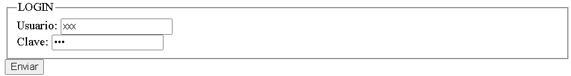 <br>
2.
```html
<form id="form2" name="form2" action="" method="get" target="_blank">
LOGIN<br />
<label>Usuario: <input type="text" id="usu2" name="usu2" /></label><br />
<label>Clave: <input type="text" id="clave2" name="clave2" /></label><br />
<input type="submit" id="boton2" name="boton2" value="Enviar" />
</form>
```
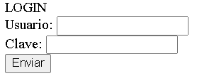 <br>
3. 
```html
<form id="form3" name="form3" action="mailto:xx@xx.com” enctype=text/plain method="post" target="_blank">
<fieldset>
<legend>LOGIN</legend>
Usuario: <input type="text" id="usu3" name="usu3" /><br />
Clave: <input type="password" id="clave3" name="clave3" />
</fieldset>
<input type="reset" id="boton3" name="boton3" value=
"Enviar" />
</form>
```
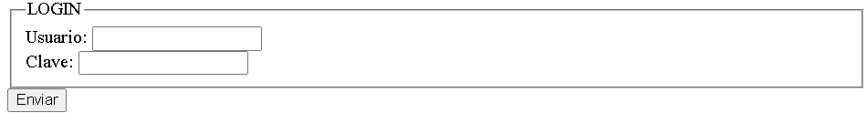

La primera diferencia radica en las acciones de cada uno de estos formularios. Con la etiqueta `action`, podemos observar lo siguiente:
- En el primer formulario, una vez que se envía, los datos ingresados se dirigirán al archivo "procesra.php" en el servidor de procesamiento.
- El segundo formulario no tiene actividad asociada.
- El tercer formulario envía los datos del formulario por correo electrónico a xx@xx.com.

Otra diferencia notable está en el atributo `method`, donde el primer y tercer formulario utilizan el método "POST". Esto significa que los datos del formulario se enviarán al servidor a través de una solicitud HTTP POST, lo que los mantendrá invisibles en la URL. En cambio, el segundo formulario utiliza el método "GET", lo que implica que los datos se agregarán a la URL como parámetros de consulta.

Además, en la parte 1 y 2, se utilizan las etiquetas `<fieldset>` para agrupar y organizar elementos de formulario dentro del formulario. La ausencia de esta etiqueta en la parte 2 explica por qué las etiquetas `<label>` para "Usuario" y "Clave" también están ausentes en el código 2.

En el código 1, dentro de los elementos `<input>` de tipo texto para "Usuario" y "Clave", se emplean los atributos `value`. Estos atributos permiten que, al cargar el formulario, estos campos muestren los datos que se indican.

Por último, en el código 3, la función del botón se logra con un `<input>` de tipo "reset", a diferencia de los códigos 1 y 2 que usan `<input>` de tipo "submit". El uso del tipo "reset" no solo envía el formulario, sino que también restablece los campos a sus valores predefinidos.

## Inciso i
1.
```html
<label>Botón 1
<button type="button" name="boton1" id="boton1">
<br />
<b>CLICK AQUÍ</b></button></label>
```
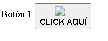 <br>
2.
```html
<label>Botón 2
<input type="button" name="boton2" id="boton2" value="CLICK AQUÍ" />
</label>
```
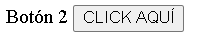

 En este caso, nos encontramos con dos botones, siendo la característica más destacada en el punto 1 la inclusión de una imagen dentro del botón. Esta imagen se diferencia mediante la inclusión de atributos relacionados con la imagen. A pesar de que ambos botones contienen la leyenda "CLICK AQUÍ", la adición de una imagen en el punto 1 es la diferencia principal.

En el punto 2, el botón también posee el atributo `value`, en el cual se aclara el valor del botón. Este atributo es una particularidad del botón en el punto 2 y no está presente en el botón del punto 1.

## Inciso j
1.
```html
<p><label><input type="radio" name="opcion" id="X" value="X" />X</label><br />
<label><input type="radio" name="opcion" id="Y" value="Y" />Y</label></p>
```
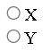 <br>
2.
```html
<p><label><input type="radio" name="opcion1" id="X" value="X" />X</label><br />
<label><input type="radio" name="opcion2" id="Y" value="Y" />Y</label></p>
```
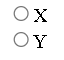

En este inciso, presentamos dos códigos que son muy similares entre sí. La distinción fundamental radica en los nombres de las opciones presentes.

En el caso 1, observamos que las distintas opciones tienen el mismo nombre, lo que permite elegir únicamente un tipo entre las dos opciones. En contraste, en la opción 2, los nombres de las opciones son diferentes, lo que nos brinda la posibilidad de seleccionar una, la otra o incluso ambas sin ningún problema.


## Inciso k
1.
```html
<select name="lista">
<optgroup label="Caso 1">
<option>Mayo</option>
<option>Junio</option>
</optgroup>
<optgroup label="Caso 2">
<option>Mayo</option>
<option>Junio</option>
</optgroup>
</select>
```
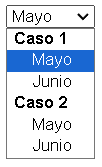 <br>
2.
```html
<select name="lista[]" multiple="multiple">
<optgroup label=" Caso 1">
<option>Mayo</option>
<option>Junio</option>
</optgroup>
<optgroup label=" Caso 2">
<option>Mayo</option>
<option>Junio</option>
</optgroup>
</select>
```
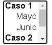

Ambos fragmentos de código emplean la etiqueta `<select>` para crear un menú desplegable en un formulario HTML, pero presentan una diferencia crucial en su comportamiento y apariencia:

En el primer caso, creamos un menú desplegable sencillo con el atributo `name="lista"`. El usuario puede seleccionar una única opción de la lista, permitiendo solo una selección. Los elementos `<optgroup>` se usan para agrupar opciones relacionadas.

En el segundo caso, creamos un menú desplegable con selección múltiple, indicado por el atributo `multiple="multiple"` en la etiqueta `<select>`. Esto habilita al usuario para seleccionar múltiples opciones, manteniendo presionada la tecla Ctrl (en Windows) o Cmd (en macOS) mientras hace clic en las opciones. El atributo `name="lista[]"` especifica que los valores seleccionados se enviarán al servidor como un array con el nombre `"lista[]"`. Los elementos `<optgroup>` se utilizan del mismo modo para agrupar opciones relacionadas.

